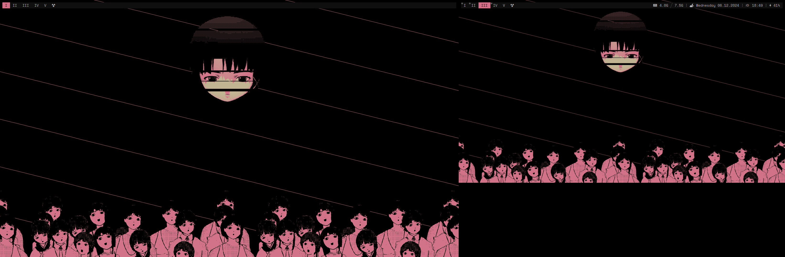
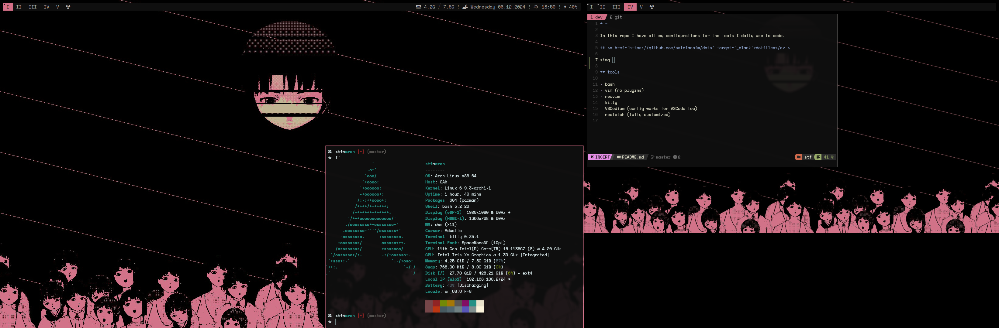

# ~

In this repo I have all my configurations for the tools I daily use to code.

## <a href='https://github.com/sstefanofm/dots' target='_blank'>dotfiles</a> <-

## tools

- bash
- vim (no plugins)
- neovim
- kitty
- VSCodium (config works for VSCode too)
- neofetch (fully customized)

